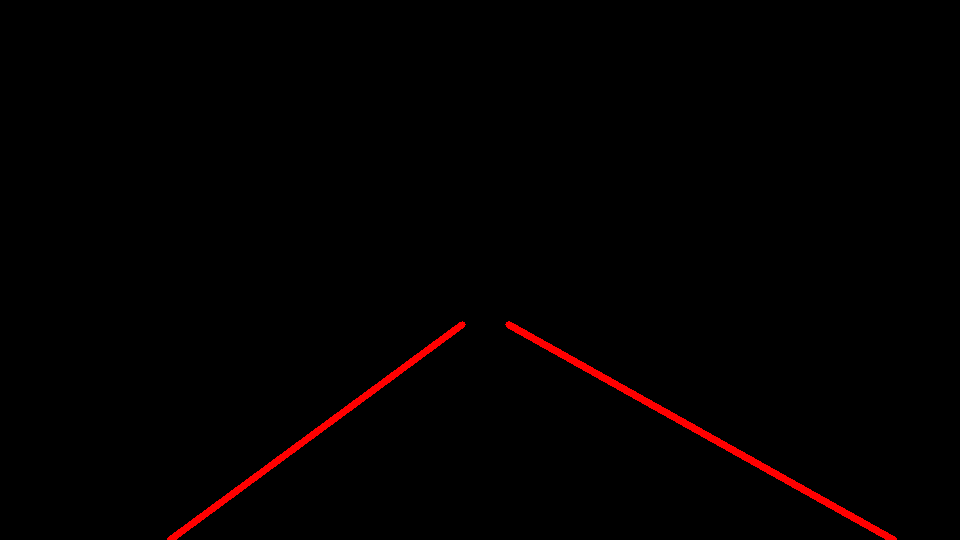
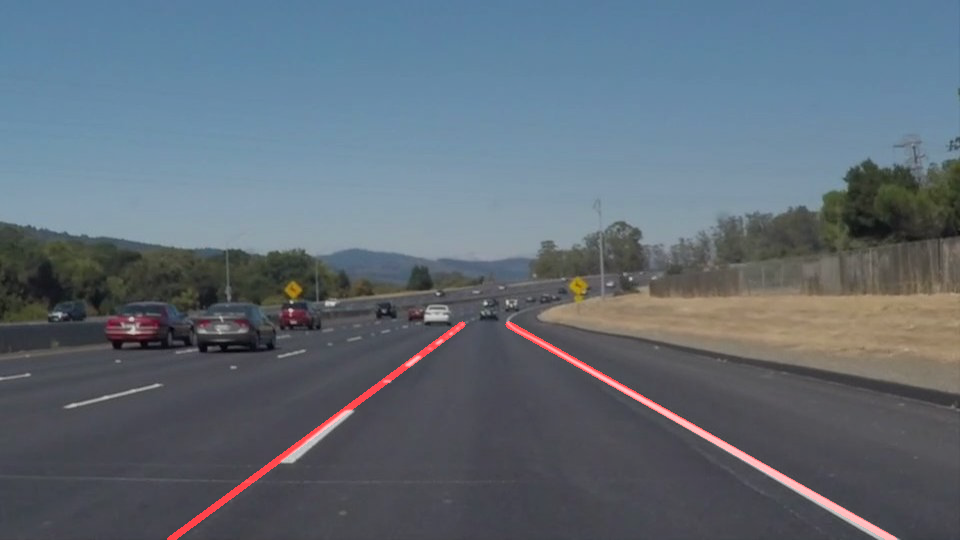

# **Finding Lane Lines on the Road**

The goals / steps of this project are the following:
* Make a pipeline that finds lane lines on the road
* Reflect on your work in a written report

---

### Reflection

### 1. Describe your pipeline. As part of the description, explain how you modified the draw_lines() function.

The pipeline consisted of 5 steps as outlined in the first week of class:
- Convert image to Grayscale

- Apply Gaussian smoothing

- Apply Canny transform

- Apply a mask to isolate the region of interest

- Do a Hough transform

- Finally, combine the drawn lines with the original image.

In order to draw a single line on the left and right lanes, I modified the draw_lines() function by:

- Computing the slope for each discovered line segment

- Extracting x,y value pairs for the segments that fall within a certain slope (isolating left from right)

- Performing a linear regression to fit a line from the top of the region to the bottom of the region (I implemented another check by not drawing lines whose r**2 value was low)

### Example of transformation

### 2. Identify potential shortcomings with your current pipeline

One potential shortcoming is that I might have "overfit" the algorithm to the given input, ie the allowed slope range for determining which lines to consider.  I do not believe this would generalize during a lane switch or a sharp curve.

Another shortcoming could be when the road is not  as smooth or highly contrasted with the lane lines.  This problem is highlighted during the "Challenge" part of the project.  When the pavement became lighter, my algorithm struggled to find the yellow lane marker.

### 3. Suggest possible improvements to your pipeline

A possible improvement would be to modify the algorithm to not include such tight reins on the slopes.  Possibly finding a best fit and then throwing out lines that do not fit within a certain range of the fitted slope (rather than having a pre-defined acceptable range).

Another potential improvement could be to try an HSV transformation to isolate colors.  This might be more effective at finding lanes when the contrast between the pavement and the lines is not great.
